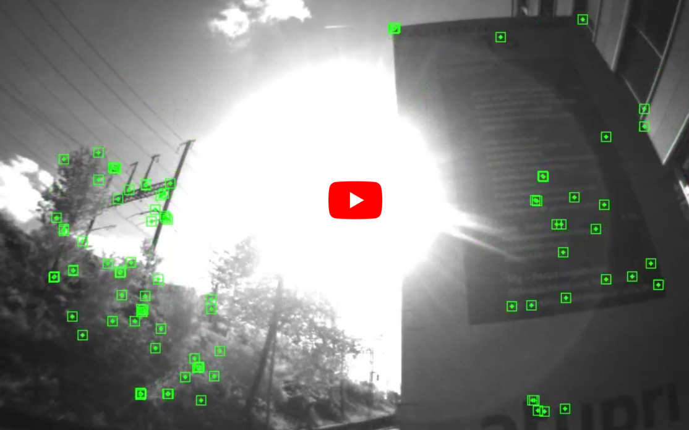

# Active Exposure Control for Robust Visual Odometry in HDR Environments

[](https://youtu.be/TKJ8vknIXbM)

This repo contains a camera controller that adjusts the exposure time and gain of the camera automatically. The gain control is based on heuristics: if the exposure time is above a specified threshold, increase the gain and vice versa. As for the exposure control, several methods are implemented, see following for details.

## Publication
If you use this code in an academic context, please cite the following [ICRA 2017 paper](https://rpg.ifi.uzh.ch/docs/ICRA17_Zhang.pdf).

Z. Zhang, C. Forster and D. Scaramuzza,
"**Active Exposure Control for Robust Visual Odometry in HDR Environments**,"
IEEE/RSJ International Conference on Robotics and Automation (ICRA). 2017.

```
@InProceedings{zhang2017active,
  title={Active exposure control for robust visual odometry in HDR environments},
  author={Zhang, Zichao and Forster, Christian and Scaramuzza, Davide},
  booktitle={2017 IEEE international conference on robotics and automation (ICRA)},
  pages={3894--3901},
  year={2017},
  organization={IEEE}
}
```

## Install

The code has been tested on

* Ubuntu 18.04 with ROS Melodic
* Ubuntu 20.04 with ROS Noetic

### Clone and compile

Create a workspace and clone the code (`ROS-DISTRO`=`melodic`/`noetic`):
```sh
mkdir catkin_ws && cd catkin_ws
catkin config --init --mkdirs --extend /opt/ros/<ROS-DISTRO> --cmake-args -DCMAKE_BUILD_TYPE=Release
cd src
git clone git@github.com:uzh-rpg/active_camera_exposure_control.git
vcs-import < ./active_camera_exposure_control/dependencies.yaml
catkin build
```

## Usage

The automatic camera control is implemented in the  `AutoCameraSettings` class. It is agnostic to camera drivers. To use it, you need to first create the controller object (or use the factory method in `auto_camera_settings_factory.cpp`):
```
AutoCameraOptions options;
// set parameters: see below for details
......
// load photometric model
photometric_camera::PhotometricModel::Ptr photo_model =
  photometric_camera::PhotometricModel::loadModel(photometric_calib_dir, 1.0);
std::shared_ptr<AutoCameraSettings> controller = std::make_shared<AutoCameraSettings>(options, photo_model);
```

Then use it within the image capture function of your driver:
```
// before capture images: apply settings
int des_exp_time_us = controller->getDesiredExposureTimeUs();
float des_gain_x = controller->getDesiredGainX();
if (des_exp_time_us != cur_exposure_time_us)
{
  changeExposureTime(des_exp_time_us);
  if (std::fabs(des_gain_x - current_gain_x) > 0.1)
  {
    changeGain(des_gain_x);
  }
}

// capture images
......

// after capture images: pass the image/capture information to the controller to calcualte the next settings
if (std::abs(controller->getDesiredExposureTimeUs() - capture_info.exposure_time_us) < 5)
{
    auto_cam_settings_->setNextFrame(img, capture_info.exposure_time_us,
                                     auto_exposure_utils::gainDbToX(capture_info.gain_db));
}
```

### Parameters
There are a lot pf parameters you can change (see `auto_camera_settings.h` for details), most of which should be left as they are. Most important parameters are the ones controlling which exposure control method to use:
```
// do not change the exposure time
options.ae_method = AutoExposureMethod::kFixed;

// Try to keep the average intensity of the image to 127. Despite of its simplicity, it performs quite well in different scenarios and is very efficient to compute.
options.ae_method = AutoExposureMethod::kMeanIntensity;

// Adjust the exposure time based on the derivative of the image gradient with respect to the exposure time.
// Less prone to over-exposure than the average intensity, but requires more computation.
// Z. Zhang, C. Forster, D. Scaramuzza
// Active Exposure Control for Robust Visual Odometry in HDR Environments
options.ae_method = AutoExposureMethod::kPercentile,

// Sweep the possible exposure times to find the setting that has the most gradient information.
// It is computational expensive but quite stable
options.ae_method = AutoExposureMethod::kSweep;

// Shim, Inwook, Joon-Young Lee, and In So Kweon. "Auto-adjusting camera
// exposure for outdoor robotics using gradient information."
options.ae_method = AutoExposureMethod::kShim;
```

## License

The code is licensed under GPLv3. For commercial use, please contact the authors at sdavide@ifi.uzh.ch.